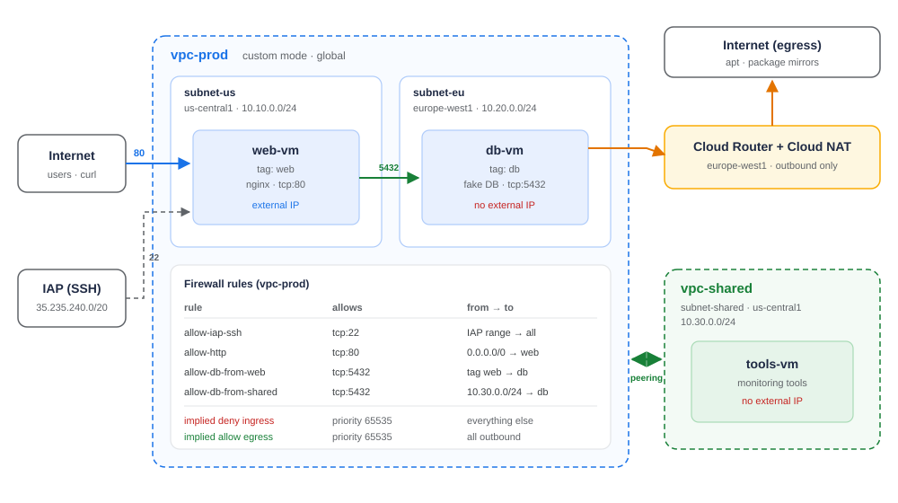
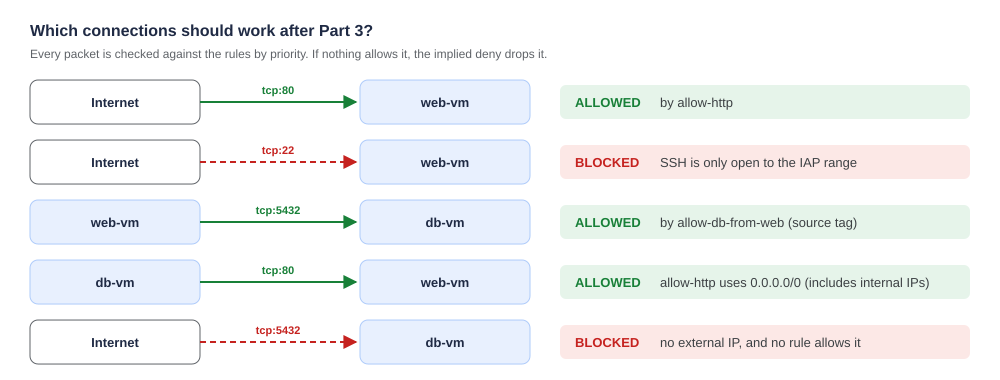
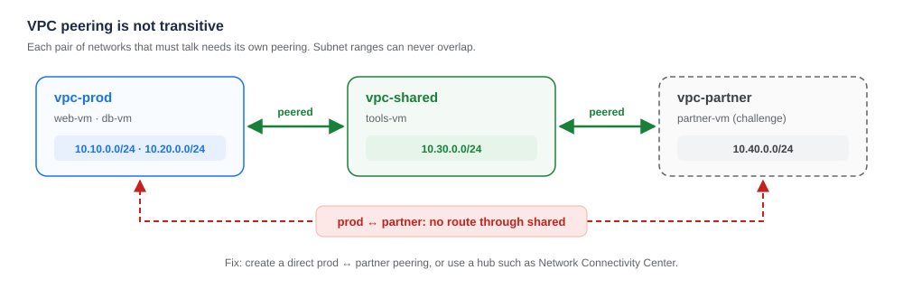

# GCP Networking Lab 

Hands-on exercise for the **GCP Networking** session (*Networking and connectivity*). You build a small, realistic network from scratch: a public web server, a private database, the firewall rules between them, outbound internet for the private VM, and a second network connected by VPC peering.

Every step has three parts. **Why** explains the concept from the slides, **Do it** has the commands to run, and **Check** tells you what you should see before moving on.



---

## Table of contents

- [GCP Networking Lab](#gcp-networking-lab)
  - [Table of contents](#table-of-contents)
  - [What you will learn](#what-you-will-learn)
  - [Before you start](#before-you-start)
  - [Part 0 — Set up Cloud Shell](#part-0--set-up-cloud-shell)
    - [Do it](#do-it)
    - [Check](#check)
  - [Part 1 — Create a custom VPC with two subnets](#part-1--create-a-custom-vpc-with-two-subnets)
    - [Why](#why)
    - [Do it](#do-it-1)
    - [Check](#check-1)
  - [Part 2 — Create the VMs](#part-2--create-the-vms)
    - [Why](#why-1)
    - [Do it](#do-it-2)
    - [Check](#check-2)
  - [Part 3 — Firewall rules: from "nothing works" to least privilege](#part-3--firewall-rules-from-nothing-works-to-least-privilege)
    - [Why](#why-2)
    - [3.1 Prove that everything is closed](#31-prove-that-everything-is-closed)
    - [3.2 Allow SSH only through IAP](#32-allow-ssh-only-through-iap)
    - [3.3 Open the web to the internet, only for VMs tagged `web`](#33-open-the-web-to-the-internet-only-for-vms-tagged-web)
    - [3.4 Database: only the web can reach it](#34-database-only-the-web-can-reach-it)
    - [3.5 Log what gets blocked](#35-log-what-gets-blocked)
    - [3.6 Priorities: a DENY with more priority wins](#36-priorities-a-deny-with-more-priority-wins)
    - [3.7 Check: the expected results](#37-check-the-expected-results)
    - [3.8 See the logs in Cloud Logging](#38-see-the-logs-in-cloud-logging)
  - [Part 4 — Egress: give the private VM internet with Cloud NAT](#part-4--egress-give-the-private-vm-internet-with-cloud-nat)
    - [Why](#why-3)
    - [4.1 Check that db-vm has no internet](#41-check-that-db-vm-has-no-internet)
    - [4.2 Create Cloud Router + Cloud NAT in europe-west1](#42-create-cloud-router--cloud-nat-in-europe-west1)
    - [4.3 Check](#43-check)
    - [4.4 Egress rules: block outbound traffic too](#44-egress-rules-block-outbound-traffic-too)
  - [Part 5 — Connect a second VPC with VPC peering](#part-5--connect-a-second-vpc-with-vpc-peering)
    - [Why](#why-4)
    - [5.1 Create the second network and a VM with no external IP](#51-create-the-second-network-and-a-vm-with-no-external-ip)
    - [5.2 Before peering: no route](#52-before-peering-no-route)
    - [5.3 Create the peering (both sides)](#53-create-the-peering-both-sides)
    - [5.4 Test again](#54-test-again)
    - [Check](#check-3)
  - [Part 6 — Challenge: peering is not transitive](#part-6--challenge-peering-is-not-transitive)
  - [Review questions](#review-questions)
  - [Troubleshooting](#troubleshooting)
  - [Clean up](#clean-up)
  - [References](#references)

---

## What you will learn

| Session topic | What you do in this lab |
|---|---|
| **Virtual Private Cloud (VPC)** | Create a *custom-mode* VPC. You will see that it is global, while its subnets are regional. |
| **Subnets and ports** | Create two subnets in two regions with non-overlapping CIDR ranges. Run services on ports 80 and 5432. |
| **Firewalls** | Start from the implied *deny all ingress*. Open only what is needed using tags, priorities and logging. |
| **Ingress and egress** | Keep a VM private (no external IP) and give it outbound internet with Cloud NAT. Block egress with a firewall rule. |
| **VPC peering** | Connect two VPCs over internal IPs and prove that peering is **not transitive**. |

**Time:** about 90 minutes (plus about 20 for the challenge).
**Level:** beginner/intermediate. You only need to be comfortable with a terminal.

---

## Before you start

You need:

1. A Google Cloud project with **billing enabled**, where you are **Owner** or **Editor**.
2. **Cloud Shell**: open [console.cloud.google.com](https://console.cloud.google.com) and click the terminal icon `>_` at the top right. Everything in this lab runs from there.

> [!WARNING]
> **Cost.** The lab uses three or four `e2-micro` VMs, one Cloud NAT gateway and a few logs. If you finish it in one go and run the [clean-up](#clean-up), the cost is a few cents. **If you forget to clean up, the VMs and Cloud NAT keep charging every hour.**


---

## Part 0 — Set up Cloud Shell

### Do it

```bash
# 1. Clone the repo and move into it
git clone https://github.com/<your-user>/gcp-networking-lab.git
cd gcp-networking-lab

# 2. Select your project
gcloud config set project <YOUR_PROJECT_ID>

# 3. Enable the APIs used in the lab
gcloud services enable compute.googleapis.com iap.googleapis.com logging.googleapis.com

# 4. Load the lab variables (repeat this in every new Cloud Shell tab)
source scripts/00-env.sh
```

### Check

The last command prints your project and the two regions:

```text
Project:  my-project-123
Regions:  us-central1 (us-central1-a) and europe-west1 (europe-west1-b)
```

---

## Part 1 — Create a custom VPC with two subnets

### Why

Every new project includes a `default` network in **auto mode**, with one subnet per region and fairly open firewall rules. It is convenient, but you do not decide the IP ranges and it opens more than you need. In production you use **custom mode**: you create only the subnets you need, with ranges you choose.

Two ideas from the session that you will see here:

- **The VPC is global**: a single `vpc-prod` covers every region. You do not need one network per region or peering between regions.
- **Subnets are regional** and define the CIDR range their VMs get IPs from. Ranges cannot overlap within a VPC, or with any VPC you will peer with later.

| Subnet | Region | CIDR range | Usable IPs |
|---|---|---|---|
| `subnet-us` | us-central1 | `10.10.0.0/24` | 252 (Google reserves 4 per subnet) |
| `subnet-eu` | europe-west1 | `10.20.0.0/24` | 252 |

### Do it

```bash
gcloud compute networks create vpc-prod \
  --subnet-mode=custom \
  --bgp-routing-mode=global

gcloud compute networks subnets create subnet-us \
  --network=vpc-prod --region=us-central1 --range=10.10.0.0/24

gcloud compute networks subnets create subnet-eu \
  --network=vpc-prod --region=europe-west1 --range=10.20.0.0/24
```

### Check

```bash
gcloud compute networks subnets list --network=vpc-prod
```

```text
NAME       REGION        NETWORK   RANGE
subnet-eu  europe-west1  vpc-prod  10.20.0.0/24
subnet-us  us-central1   vpc-prod  10.10.0.0/24
```

In the console: **VPC network → VPC networks → vpc-prod**. Open the **Firewall** tab and notice it is **empty**. That is important for Part 3.

> [!NOTE]
> **Think about it:** try to create a third subnet with range `10.10.0.0/16`. What happens and why?

---

## Part 2 — Create the VMs

### Why

We will simulate a classic two-tier application:

| VM | Subnet | Network tag | External IP | What it runs |
|---|---|---|---|---|
| `web-vm` | subnet-us | `web` | **Yes** | nginx on port **80** |
| `db-vm` | subnet-eu | `db` | **No** | a fake database on port **5432** |

- **Network tags** (`web`, `db`) are labels that firewall rules use to decide which VMs a rule applies to.
- `db-vm` gets **no external IP** (`--no-address`). It cannot be reached from the internet even if a rule allowed it, and it cannot reach the internet on its own. That is what we want for a database.
- The "database" is a tiny HTTP server that Python serves on port 5432. It lets us test firewall rules with `curl` without installing PostgreSQL.

### Do it

```bash
gcloud compute instances create web-vm \
  --zone=us-central1-a --machine-type=e2-micro \
  --subnet=subnet-us --tags=web \
  --image-family=debian-12 --image-project=debian-cloud \
  --metadata-from-file=startup-script=startup/web.sh

gcloud compute instances create db-vm \
  --zone=europe-west1-b --machine-type=e2-micro \
  --subnet=subnet-eu --tags=db --no-address \
  --image-family=debian-12 --image-project=debian-cloud \
  --metadata-from-file=startup-script=startup/db.sh
```

Save the IPs in variables, because you will use them all the time:

```bash
export WEB_EXT=$(gcloud compute instances describe web-vm --zone=us-central1-a --format='get(networkInterfaces[0].accessConfigs[0].natIP)')
export WEB_INT=$(gcloud compute instances describe web-vm --zone=us-central1-a --format='get(networkInterfaces[0].networkIP)')
export DB_INT=$(gcloud compute instances describe db-vm --zone=europe-west1-b --format='get(networkInterfaces[0].networkIP)')
echo "web-vm external=$WEB_EXT internal=$WEB_INT | db-vm internal=$DB_INT"
```

### Check

```bash
gcloud compute instances list
```

`web-vm` has an IP `10.10.0.x` and an external IP. `db-vm` has an IP `10.20.0.x` and **no** external IP. Each internal IP comes from its subnet's range.

---

## Part 3 — Firewall rules: from "nothing works" to least privilege

### Why

Every VPC has two **implied rules** that you cannot see or delete. Both have the lowest priority (65535):

| Implied rule | Effect |
|---|---|
| **Deny all ingress** | Blocks all inbound traffic unless a rule allows it. |
| **Allow all egress** | Allows all outbound traffic unless a rule blocks it. |

GCP firewall rules are **stateful**: if a connection is allowed in, its reply goes back out automatically. Rules are evaluated by **priority**, where **lower number = more priority**. The first rule that matches decides.

Anatomy of a rule:

| Field | Example | Meaning |
|---|---|---|
| Direction | `INGRESS` | inbound or outbound traffic |
| Priority | `1000` | 0–65535, lower wins |
| Action | `ALLOW` / `DENY` | what to do if it matches |
| Target | `--target-tags=web` | which VMs it applies to |
| Source | `--source-ranges` / `--source-tags` | where the traffic comes from |
| Protocol / port | `tcp:80` | which traffic |

### 3.1 Prove that everything is closed

```bash
curl -s --max-time 5 http://$WEB_EXT || echo "TIMEOUT: no rule allows tcp:80"

gcloud compute ssh web-vm --zone=us-central1-a --tunnel-through-iap --command="hostname"
# → fails: no rule allows tcp:22 either
```

Both fail even though nginx is running. **The implied deny ingress is doing its job.**

### 3.2 Allow SSH only through IAP

Instead of opening port 22 to the internet, we use **Identity-Aware Proxy (IAP)**. Google proxies the SSH connection from the fixed range `35.235.240.0/20`, after checking your identity with IAM. That way you can SSH into VMs **without an external IP**, such as `db-vm`.

```bash
gcloud compute firewall-rules create allow-iap-ssh \
  --network=vpc-prod --direction=INGRESS --action=ALLOW \
  --rules=tcp:22 --source-ranges=35.235.240.0/20 --priority=1000
```

```bash
gcloud compute ssh web-vm --zone=us-central1-a --tunnel-through-iap --command="hostname"
```

> [!NOTE]
> The first time, Cloud Shell asks you to create an SSH key. Press Enter (no passphrase needed for the lab).

### 3.3 Open the web to the internet, only for VMs tagged `web`

```bash
gcloud compute firewall-rules create allow-http \
  --network=vpc-prod --direction=INGRESS --action=ALLOW \
  --rules=tcp:80 --source-ranges=0.0.0.0/0 --target-tags=web \
  --priority=1000 --enable-logging

curl http://$WEB_EXT
# <h1>Hello from web-vm</h1>
```

### 3.4 Database: only the web can reach it

The database must not accept connections from just anyone. The rule says: **from VMs tagged `web`, to VMs tagged `db`, port 5432 only**.

First, check that it is blocked:

```bash
gcloud compute ssh web-vm --zone=us-central1-a --tunnel-through-iap \
  --command="curl -s --max-time 5 http://$DB_INT:5432 || echo BLOCKED"
# BLOCKED
```

Create the rule and try again:

```bash
gcloud compute firewall-rules create allow-db-from-web \
  --network=vpc-prod --direction=INGRESS --action=ALLOW \
  --rules=tcp:5432 --source-tags=web --target-tags=db \
  --priority=1000 --enable-logging

gcloud compute ssh web-vm --zone=us-central1-a --tunnel-through-iap \
  --command="curl -s --max-time 5 http://$DB_INT:5432"
# fake-db OK from db-vm (10.20.0.x)
```

> [!IMPORTANT]
> `web-vm` is in **us-central1** and `db-vm` in **europe-west1**, yet they talk over **internal IPs** without a VPN or peering. That is because the VPC is **global**.

### 3.5 Log what gets blocked

The implied deny **never writes logs**. To see who is being rejected, add an explicit deny at a priority just above it, with logging enabled:

```bash
gcloud compute firewall-rules create deny-all-ingress-logged \
  --network=vpc-prod --direction=INGRESS --action=DENY \
  --rules=all --source-ranges=0.0.0.0/0 \
  --priority=65000 --enable-logging
```

### 3.6 Priorities: a DENY with more priority wins

Create a temporary rule that blocks port 80 with **priority 500**. It is a lower number than `allow-http` (1000), so it is evaluated first.

```bash
gcloud compute firewall-rules create deny-http-temp \
  --network=vpc-prod --direction=INGRESS --action=DENY \
  --rules=tcp:80 --source-ranges=0.0.0.0/0 --target-tags=web --priority=500

sleep 10; curl -s --max-time 5 http://$WEB_EXT || echo "BLOCKED by deny-http-temp"
```

Delete it and check that the web works again:

```bash
gcloud compute firewall-rules delete deny-http-temp --quiet
sleep 10; curl http://$WEB_EXT
```

### 3.7 Check: the expected results



You can run every check at once:

```bash
bash scripts/test-connectivity.sh
```

### 3.8 See the logs in Cloud Logging

Generate some traffic (`curl http://$WEB_EXT` a few times). Then open **Logging → Logs Explorer** and paste this query:

```text
logName:"compute.googleapis.com%2Ffirewall"
jsonPayload.rule_details.reference:"vpc-prod"
```

Each entry has the source and destination IP and port (`jsonPayload.connection`), the rule that matched (`jsonPayload.rule_details.reference`) and the decision (`jsonPayload.disposition`: `ALLOWED` / `DENIED`). Look for entries from `deny-all-ingress-logged`: they are often bots scanning the internet.

> [!NOTE]
> Firewall logs take 1–2 minutes to appear.

---

## Part 4 — Egress: give the private VM internet with Cloud NAT

### Why

`db-vm` has no external IP, so it cannot download updates or packages. But we **do not** want to give it a public IP, because that would expose it to the internet.

**Cloud NAT** solves this: it translates the private IPs of a region to a public IP **for outbound traffic only**. Nobody from the internet can start a connection to the VM. Cloud NAT is regional and needs a **Cloud Router**, which here only serves as its control plane.

### 4.1 Check that db-vm has no internet

```bash
gcloud compute ssh db-vm --zone=europe-west1-b --tunnel-through-iap \
  --command="curl -s -o /dev/null -w '%{http_code}\n' --max-time 5 https://deb.debian.org || echo NO_INTERNET"
# NO_INTERNET
```

### 4.2 Create Cloud Router + Cloud NAT in europe-west1

```bash
gcloud compute routers create nat-router-eu \
  --network=vpc-prod --region=europe-west1

gcloud compute routers nats create nat-eu \
  --router=nat-router-eu --region=europe-west1 \
  --auto-allocate-nat-external-ips \
  --nat-all-subnet-ip-ranges \
  --enable-logging
```

### 4.3 Check

Wait about 30 seconds and repeat the test:

```bash
gcloud compute ssh db-vm --zone=europe-west1-b --tunnel-through-iap \
  --command="curl -s -o /dev/null -w '%{http_code}\n' --max-time 5 https://deb.debian.org"
# 200
```

`db-vm` now **goes out** to the internet, but still has no external IP: `gcloud compute instances list` shows `EXTERNAL_IP` empty.

### 4.4 Egress rules: block outbound traffic too

The implied *allow all egress* can be restricted. For example, the database should not be able to make HTTPS calls to the internet (to stop data exfiltration):

```bash
gcloud compute firewall-rules create deny-db-egress-https \
  --network=vpc-prod --direction=EGRESS --action=DENY \
  --rules=tcp:443 --destination-ranges=0.0.0.0/0 --target-tags=db \
  --priority=900

sleep 10
gcloud compute ssh db-vm --zone=europe-west1-b --tunnel-through-iap \
  --command="curl -s -o /dev/null -w '%{http_code}\n' --max-time 5 https://deb.debian.org || echo BLOCKED_BY_EGRESS_RULE"
```

Even with Cloud NAT in place, the firewall decides **first**. Delete the rule to continue:

```bash
gcloud compute firewall-rules delete deny-db-egress-https --quiet
```

---

## Part 5 — Connect a second VPC with VPC peering

### Why

Imagine another team manages monitoring tools in **its own VPC** (`vpc-shared`). They need to reach our servers over **internal IPs**, without going through the internet and without merging the networks. That is **VPC peering**:

- Traffic stays on Google's network, using private IPs.
- Each VPC keeps its **own firewall rules** and its own administration.
- It must be created **from both sides**. Until both exist, the state is `INACTIVE`.
- Ranges **cannot overlap**: that is why `vpc-shared` uses `10.30.0.0/24`.

### 5.1 Create the second network and a VM with no external IP

```bash
gcloud compute networks create vpc-shared --subnet-mode=custom
gcloud compute networks subnets create subnet-shared \
  --network=vpc-shared --region=us-central1 --range=10.30.0.0/24

gcloud compute firewall-rules create shared-allow-iap-ssh \
  --network=vpc-shared --direction=INGRESS --action=ALLOW \
  --rules=tcp:22 --source-ranges=35.235.240.0/20

gcloud compute instances create tools-vm \
  --zone=us-central1-a --machine-type=e2-micro \
  --subnet=subnet-shared --no-address \
  --image-family=debian-12 --image-project=debian-cloud \
  --metadata-from-file=startup-script=startup/db.sh
```

### 5.2 Before peering: no route

```bash
gcloud compute ssh tools-vm --zone=us-central1-a --tunnel-through-iap \
  --command="curl -s --max-time 5 http://$WEB_INT || echo NO_ROUTE"
# NO_ROUTE
```

### 5.3 Create the peering (both sides)

```bash
gcloud compute networks peerings create prod-to-shared \
  --network=vpc-prod --peer-network=vpc-shared

gcloud compute networks peerings list   # STATE: INACTIVE (only one side exists)

gcloud compute networks peerings create shared-to-prod \
  --network=vpc-shared --peer-network=vpc-prod

gcloud compute networks peerings list   # STATE: ACTIVE on both sides
```

Look at the routes that were imported automatically:

```bash
gcloud compute routes list --filter="network:vpc-shared"
```

You will see that `vpc-shared` now knows how to reach `10.10.0.0/24` and `10.20.0.0/24` through the peering.

### 5.4 Test again

```bash
# tools-vm → web-vm:80  (works: allow-http allows 0.0.0.0/0, which includes 10.30.0.0/24)
gcloud compute ssh tools-vm --zone=us-central1-a --tunnel-through-iap \
  --command="curl -s --max-time 5 http://$WEB_INT"

# tools-vm → db-vm:5432 (BLOCKED)
gcloud compute ssh tools-vm --zone=us-central1-a --tunnel-through-iap \
  --command="curl -s --max-time 5 http://$DB_INT:5432 || echo BLOCKED"
```

Why is the second one blocked? The rule `allow-db-from-web` uses `--source-tags=web`, and **network tags do not cross a peering**: `tools-vm` is not "web" from `vpc-prod`'s point of view. For traffic coming from a peered network you must allow its **IP range**:

```bash
gcloud compute firewall-rules create allow-db-from-shared \
  --network=vpc-prod --direction=INGRESS --action=ALLOW \
  --rules=tcp:5432 --source-ranges=10.30.0.0/24 --target-tags=db \
  --priority=1000 --enable-logging

sleep 10
gcloud compute ssh tools-vm --zone=us-central1-a --tunnel-through-iap \
  --command="curl -s --max-time 5 http://$DB_INT:5432"
# fake-db OK from db-vm
```

### Check

```bash
bash scripts/test-connectivity.sh
```

```text
  Internet  -> web-vm   tcp:80                     OK
  web-vm    -> db-vm    tcp:5432                   OK
  db-vm     -> internet (apt mirror)               OK
  tools-vm  -> web-vm   tcp:80 (peering)           OK
  tools-vm  -> db-vm    tcp:5432 (peering)         OK
```

---

## Part 6 — Challenge: peering is not transitive



A partner needs to connect to `vpc-shared`. Without copying the commands above, you need to:

1. Create `vpc-partner` with a subnet `subnet-partner` in `us-central1`, range `10.40.0.0/24`. Add an IAP SSH rule and a VM `partner-vm` with no external IP.
2. Create the peering **vpc-shared ↔ vpc-partner** (both sides).
3. From `partner-vm`, try `curl http://$WEB_INT`.

**Questions:**

- Does it work? Why not, if `vpc-partner` → `vpc-shared` → `vpc-prod` are all peered?
- Run `gcloud compute routes list --filter="network:vpc-partner"`. Does it have a route to `10.10.0.0/24`?
- What would you need to do so that `partner-vm` can reach `web-vm`?
- What happens if you try to peer `vpc-prod` with a VPC that uses `10.10.0.0/24`?

<details>
<summary>Show the solution</summary>

```bash
gcloud compute networks create vpc-partner --subnet-mode=custom
gcloud compute networks subnets create subnet-partner --network=vpc-partner --region=us-central1 --range=10.40.0.0/24
gcloud compute firewall-rules create partner-allow-iap-ssh --network=vpc-partner --direction=INGRESS --action=ALLOW --rules=tcp:22 --source-ranges=35.235.240.0/20
gcloud compute instances create partner-vm --zone=us-central1-a --machine-type=e2-micro --subnet=subnet-partner --no-address --image-family=debian-12 --image-project=debian-cloud

gcloud compute networks peerings create shared-to-partner --network=vpc-shared  --peer-network=vpc-partner
gcloud compute networks peerings create partner-to-shared --network=vpc-partner --peer-network=vpc-shared

gcloud compute ssh partner-vm --zone=us-central1-a --tunnel-through-iap --command="curl -s --max-time 5 http://$WEB_INT || echo NO_ROUTE"
# NO_ROUTE
```

- **It does not work** because peering is **not transitive**. `vpc-shared` does not re-export the routes it learns from `vpc-prod` to `vpc-partner`.
- `vpc-partner` only has routes to `10.40.0.0/24` (its own) and `10.30.0.0/24` (its peer). **It has no route to `10.10.0.0/24`.**
- Solutions: create a **direct `vpc-prod ↔ vpc-partner` peering**, and also a rule in `vpc-prod` that allows `10.40.0.0/24`. For many networks, use a hub such as **Network Connectivity Center** or a **Shared VPC**.
- Peering with overlapping ranges **fails when you create it**: GCP does not allow two peered networks with the same or overlapping subnets.

</details>

---

## Review questions

<details>
<summary><b>1.</b> Why did we create the VPC in <i>custom</i> mode and not use the <code>default</code> network?</summary>

Because in custom mode **you decide** which subnets exist and with which ranges. The `default` network creates one subnet per region with predefined ranges and fairly open rules (for example SSH and RDP from anywhere). In production, those ranges could collide with your offices or with other VPCs you want to peer with.
</details>

<details>
<summary><b>2.</b> Before Part 3, nginx was running but <code>curl</code> failed. Which rule blocked it?</summary>

The **implied deny all ingress** rule (priority 65535). Every VPC has it, you cannot delete it and it does not write logs.
</details>

<details>
<summary><b>3.</b> What is the difference between <code>--source-tags</code> and <code>--source-ranges</code>? When can you NOT use tags?</summary>

`--source-ranges` filters by **source IP** (CIDR). `--source-tags` filters by the **tag of the source VM**, which is more flexible because it does not depend on IPs. Tags only work **within the same VPC**: for traffic that comes through a peering, from the internet or from on-premises, you must use IP ranges.
</details>

<details>
<summary><b>4.</b> If <code>allow-http</code> (priority 1000, ALLOW) and <code>deny-http-temp</code> (priority 500, DENY) both match, which wins?</summary>

`deny-http-temp`, because **500 < 1000**: a lower number means more priority. At equal priority, DENY wins over ALLOW.
</details>

<details>
<summary><b>5.</b> Does Cloud NAT allow someone from the internet to connect to <code>db-vm</code>?</summary>

**No.** Cloud NAT only translates connections **started by the VM** to the outside (egress). It does not open any inbound port.
</details>

<details>
<summary><b>6.</b> <code>web-vm</code> (us-central1) and <code>db-vm</code> (europe-west1) talk over internal IPs. Why don't they need peering or a VPN?</summary>

Because **a VPC is a global resource**: all its subnets, in any region, share the same internal routing.
</details>

<details>
<summary><b>7.</b> Is the firewall stateful? What does that mean for the replies from <code>web-vm</code>?</summary>

Yes. If an inbound connection is allowed, its reply traffic is allowed automatically without an egress rule. That is why `allow-http` is enough to load the page.
</details>

---

## Troubleshooting

| Problem | Likely cause and fix |
|---|---|
| `gcloud compute ssh ... --tunnel-through-iap` fails with `failed to connect to backend` or error `4003` | The `allow-iap-ssh` rule is missing in that VPC, or the VM is still booting. Wait 30 s and check the rule exists. |
| `curl http://$WEB_EXT` returns `Connection refused` (not a timeout) | The firewall lets it through, but nginx is not running yet. The startup script takes 1–2 minutes; check with `gcloud compute instances get-serial-port-output web-vm --zone=us-central1-a \| grep startup-script`. |
| The variables `$WEB_EXT`, `$DB_INT`… are empty | You opened a new Cloud Shell tab. Run `source scripts/00-env.sh` and re-run the `export` lines from Part 2. |
| A firewall change does not seem to apply | Rules take a few seconds to propagate. Wait 10–20 s. |
| The peering stays `INACTIVE` | You only created one side. Create the peering from the other VPC as well. |
| `Quota exceeded` when creating VMs | Projects with free credits have low limits. Use `e2-micro` and delete VMs you no longer need. |

---

## Clean up

> [!CAUTION]
> Do this when you finish. VMs and Cloud NAT charge for every hour they exist.

```bash
source scripts/00-env.sh
bash scripts/99-cleanup.sh
```

The script deletes, in order: VMs → peerings → Cloud NAT and router → firewall rules → subnets → networks. Make sure that only `default` remains (if you still have it) in **VPC network → VPC networks**.

---

## References

- [VPC networks overview](https://cloud.google.com/vpc/docs/vpc)
- [Subnets and IP ranges](https://cloud.google.com/vpc/docs/subnets)
- [VPC firewall rules](https://cloud.google.com/firewall/docs/firewalls)
- [Firewall Rules Logging](https://cloud.google.com/firewall/docs/firewall-rules-logging)
- [Using IAP for TCP forwarding](https://cloud.google.com/iap/docs/using-tcp-forwarding)
- [Cloud NAT overview](https://cloud.google.com/nat/docs/overview)
- [VPC Network Peering](https://cloud.google.com/vpc/docs/vpc-peering)
